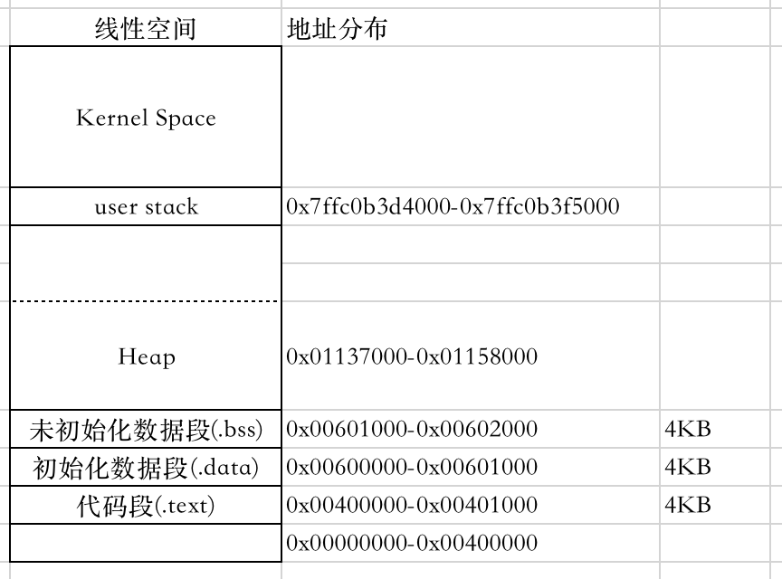

# 一文理解Linux可执行文件内存布局

参考[glibc malloc](https://sploitfun.wordpress.com/2015/02/10/understanding-glibc-malloc/)

参考[Understanding the Memory Layout of Linux Executables](https://gist.github.com/CMCDragonkai/10ab53654b2aa6ce55c11cfc5b2432a4)

阅读本文需要的Linux工具如下:

* hexdump
* objdump
* readelf
* gcore
* strace
* diff
* cat

常用的内存分配器有:

* dlmalloc - General purpose allocator
* ptmalloc2 - glibc
* jemalloc - FreeBSD and Firefox
* tcmalloc - Google
* ...

本文以glibc的malloc为主。

malloc主要使用下面两种系统调用来申请内存：

* brk
	* brk返回increment后的新断点地址，如果increment为0，即brk(0)，则返回当前断点的地址
* mmap
* 当malloc申请的地址大于阈值`MMAP_THRESHOLD`，则使用brk

## 内存布局

理论上，内存布局如下图。



下面，我使用一个简单的程序来看下进程的内存布局(gcc simple_mmap.c -o simple_mmap)。

```
#include <stdlib.h>
#include <stdio.h>

int main () {
    printf("cat /proc/%d/maps\n", getpid());

    // allocate 800B, using a brk
    char * addr = (char *) malloc(800);
    char * addr2 = NULL;

    getchar();

	addr2 = (char *) malloc(204800);
    free(addr);

    return 0;
}
```

使用strace查看syscall

```
[~@work]$ strace ./simple_mmap
execve("./simple_mmap", ["./simple_mmap"], [/* 36 vars */]) = 0
brk(0)                                  = 0xa0c000
mmap(NULL, 4096, PROT_READ|PROT_WRITE, MAP_PRIVATE|MAP_ANONYMOUS, -1, 0) = 0x7f569e0da000
access("/etc/ld.so.preload", R_OK)      = -1 ENOENT (No such file or directory)
open("tls/x86_64/libc.so.6", O_RDONLY|O_CLOEXEC) = -1 ENOENT (No such file or directory)
open("tls/libc.so.6", O_RDONLY|O_CLOEXEC) = -1 ENOENT (No such file or directory)
open("x86_64/libc.so.6", O_RDONLY|O_CLOEXEC) = -1 ENOENT (No such file or directory)
open("libc.so.6", O_RDONLY|O_CLOEXEC)   = -1 ENOENT (No such file or directory)
open("/usr/local/lib/tls/x86_64/libc.so.6", O_RDONLY|O_CLOEXEC) = -1 ENOENT (No such file or directory)
stat("/usr/local/lib/tls/x86_64", 0x7fffb5115b00) = -1 ENOENT (No such file or directory)
open("/usr/local/lib/tls/libc.so.6", O_RDONLY|O_CLOEXEC) = -1 ENOENT (No such file or directory)
stat("/usr/local/lib/tls", 0x7fffb5115b00) = -1 ENOENT (No such file or directory)
open("/usr/local/lib/x86_64/libc.so.6", O_RDONLY|O_CLOEXEC) = -1 ENOENT (No such file or directory)
stat("/usr/local/lib/x86_64", 0x7fffb5115b00) = -1 ENOENT (No such file or directory)
open("/usr/local/lib/libc.so.6", O_RDONLY|O_CLOEXEC) = -1 ENOENT (No such file or directory)
stat("/usr/local/lib", {st_mode=S_IFDIR|0755, st_size=4096, ...}) = 0
open("/etc/ld.so.cache", O_RDONLY|O_CLOEXEC) = 3
fstat(3, {st_mode=S_IFREG|0644, st_size=59934, ...}) = 0
mmap(NULL, 59934, PROT_READ, MAP_PRIVATE, 3, 0) = 0x7f569e0cb000
close(3)                                = 0
open("/lib64/libc.so.6", O_RDONLY|O_CLOEXEC) = 3
read(3, "\177ELF\2\1\1\3\0\0\0\0\0\0\0\0\3\0>\0\1\0\0\0@\34\2\0\0\0\0\0"..., 832) = 832
fstat(3, {st_mode=S_IFREG|0755, st_size=2118128, ...}) = 0
mmap(NULL, 3932672, PROT_READ|PROT_EXEC, MAP_PRIVATE|MAP_DENYWRITE, 3, 0) = 0x7f569dafb000
mprotect(0x7f569dcb1000, 2097152, PROT_NONE) = 0
mmap(0x7f569deb1000, 24576, PROT_READ|PROT_WRITE, MAP_PRIVATE|MAP_FIXED|MAP_DENYWRITE, 3, 0x1b6000) = 0x7f569deb1000
mmap(0x7f569deb7000, 16896, PROT_READ|PROT_WRITE, MAP_PRIVATE|MAP_FIXED|MAP_ANONYMOUS, -1, 0) = 0x7f569deb7000
close(3)                                = 0
mmap(NULL, 4096, PROT_READ|PROT_WRITE, MAP_PRIVATE|MAP_ANONYMOUS, -1, 0) = 0x7f569e0ca000
mmap(NULL, 8192, PROT_READ|PROT_WRITE, MAP_PRIVATE|MAP_ANONYMOUS, -1, 0) = 0x7f569e0c8000
arch_prctl(ARCH_SET_FS, 0x7f569e0c8740) = 0
mprotect(0x7f569deb1000, 16384, PROT_READ) = 0
mprotect(0x600000, 4096, PROT_READ)     = 0
mprotect(0x7f569e0db000, 4096, PROT_READ) = 0
munmap(0x7f569e0cb000, 59934)           = 0
getpid()                                = 12717
fstat(1, {st_mode=S_IFCHR|0620, st_rdev=makedev(136, 2), ...}) = 0
mmap(NULL, 4096, PROT_READ|PROT_WRITE, MAP_PRIVATE|MAP_ANONYMOUS, -1, 0) = 0x7f569e0d9000
write(1, "Look at /proc/12717/maps\n", 25Look at /proc/12717/maps
) = 25
brk(0)                                  = 0xa0c000
brk(0xa2d000)                           = 0xa2d000
brk(0)                                  = 0xa2d000
fstat(0, {st_mode=S_IFCHR|0620, st_rdev=makedev(136, 2), ...}) = 0
mmap(NULL, 4096, PROT_READ|PROT_WRITE, MAP_PRIVATE|MAP_ANONYMOUS, -1, 0) = 0x7f569e0d8000
read(0, 
```

查看/proc/{pid}/maps

```
00400000-00401000 r-xp 00000000 fd:11 6961368                            /mnt/liangtao/simple_mmap
00600000-00601000 r--p 00000000 fd:11 6961368                            /mnt/liangtao/simple_mmap
00601000-00602000 rw-p 00001000 fd:11 6961368                            /mnt/liangtao/simple_mmap
00a0c000-00a2d000 rw-p 00000000 00:00 0                                  [heap]
7f569dafb000-7f569dcb1000 r-xp 00000000 fd:01 132823                     /usr/lib64/libc-2.17.so
7f569dcb1000-7f569deb1000 ---p 001b6000 fd:01 132823                     /usr/lib64/libc-2.17.so
7f569deb1000-7f569deb5000 r--p 001b6000 fd:01 132823                     /usr/lib64/libc-2.17.so
7f569deb5000-7f569deb7000 rw-p 001ba000 fd:01 132823                     /usr/lib64/libc-2.17.so
7f569deb7000-7f569debc000 rw-p 00000000 00:00 0 
7f569debc000-7f569dedc000 r-xp 00000000 fd:01 202080                     /usr/lib64/ld-2.17.so
7f569e0c8000-7f569e0cb000 rw-p 00000000 00:00 0 
7f569e0d8000-7f569e0db000 rw-p 00000000 00:00 0 
7f569e0db000-7f569e0dc000 r--p 0001f000 fd:01 202080                     /usr/lib64/ld-2.17.so
7f569e0dc000-7f569e0dd000 rw-p 00020000 fd:01 202080                     /usr/lib64/ld-2.17.so
7f569e0dd000-7f569e0de000 rw-p 00000000 00:00 0 
7fffb50f8000-7fffb5119000 rw-p 00000000 00:00 0                          [stack]
7fffb51fb000-7fffb51fd000 r-xp 00000000 00:00 0                          [vdso]
ffffffffff600000-ffffffffff601000 r-xp 00000000 00:00 0                  [vsyscall]
```

*为什么elf文件装载到0x00400000 (64位机器)或0x08048000 (32位机器)而不是0x0呢*

参见[why-linux-gnu-linker-chose-address-0x400000](http://stackoverflow.com/questions/14314021/why-linux-gnu-linker-chose-address-0x400000)

```
程序的入口地址由linker(链接器)设置，其默认值为0x400000。
```

*那么，loader是如何获知这些信息的呢?*

loader从ehdr和phdr头中获取entry point相关信息。

```
$ readelf --file-header ./simple_mmap
ELF Header:
  Magic:   7f 45 4c 46 02 01 01 00 00 00 00 00 00 00 00 00 
  Class:                             ELF64
  Data:                              2's complement, little endian
  Version:                           1 (current)
  OS/ABI:                            UNIX - System V
  ABI Version:                       0
  Type:                              EXEC (Executable file)
  Machine:                           Advanced Micro Devices X86-64
  Version:                           0x1
  Entry point address:               0x400570
  Start of program headers:          64 (bytes into file)
  Start of section headers:          6808 (bytes into file)
  Flags:                             0x0
  Size of this header:               64 (bytes)
  Size of program headers:           56 (bytes)
  Number of program headers:         9
  Size of section headers:           64 (bytes)
  Number of section headers:         30
  Section header string table index: 27
```

Entry point address为`0x400570`.

使用命令`objdump --disassemble-all --start-address=0x000000 --stop-address=0x401000 ./simple_mmap | less +/400570`查看`.text`。

```
./simple_mmap:     file format elf64-x86-64

...

Disassembly of section .text:

0000000000400570 <_start>:
  400570:	31 ed                	xor    %ebp,%ebp
  400572:	49 89 d1             	mov    %rdx,%r9
  400575:	5e                   	pop    %rsi
  400576:	48 89 e2             	mov    %rsp,%rdx
  400579:	48 83 e4 f0          	and    $0xfffffffffffffff0,%rsp
  40057d:	50                   	push   %rax
  40057e:	54                   	push   %rsp
  40057f:	49 c7 c0 30 07 40 00 	mov    $0x400730,%r8
  400586:	48 c7 c1 c0 06 40 00 	mov    $0x4006c0,%rcx
  40058d:	48 c7 c7 5d 06 40 00 	mov    $0x40065d,%rdi
  400594:	e8 97 ff ff ff       	callq  400530 <__libc_start_main@plt>
  400599:	f4                   	hlt    
  40059a:	66 0f 1f 44 00 00    	nopw   0x0(%rax,%rax,1)
```

接下来，看下除text之外的其他两个段。

```
$ objdump --disassemble-all --start-address=0x600000 --stop-address=0x602000 ./simple_mmap | less
		...
Disassembly of section .data:

0000000000601050 <__data_start>:
  601050:       00 00                   add    %al,(%rax)
        ...

Disassembly of section .bss:

0000000000601054 <__bss_start>:
  601054:       00 00                   add    %al,(%rax)
        ...

```

在程序中，我们调用malloc(800)，即申请800个字节，heap段的实际空间如下：

```
00a0c000-00a2d000 rw-p 00000000 00:00 0                                  [heap]
```

heap实际分配了132KiB。这种连续的堆内存被称为arena。由主线程创建的即为main arena。

最后，我们看下剩下的regions。

```
7fffb50f8000-7fffb5119000 rw-p 00000000 00:00 0                          [stack] 	132 KiB
7fffb51fb000-7fffb51fd000 r-xp 00000000 00:00 0                          [vdso] 	8 KiB
ffffffffff600000-ffffffffff601000 r-xp 00000000 00:00 0                  [vsyscall] 4 KiB
```

vdso已经替换vsyscall。vsyscall被保留的原因是为了向后兼容。

* vsyscall从固定地址0xffffffffff600000开始，最大容量为8 MiB。
* vdso，不固定，其地址分配与ASLR有关。
* vsyscall提供3种系统调用: `gettimeofday, time, getcpu`
* vdso提供4种系统调用: `__vdso_clock_gettime, __vdso_getcpu, __vdso_gettimeofday,  __vdso_time`

## 参考文献

[Working with the ELF Program Format](http://www.ouah.org/RevEng/x430.htm)
