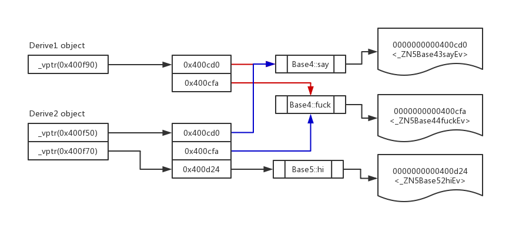

[TOC]
# 什么是虚函数

虚函数在基类中声明并由派生类重新定义（重写）的成员函数。当使用指针或对基类的引用派生类对象时，可以为该对象调用虚函数并执行派生类的函数版本。

# 类、对象、虚指针、虚函数表间的关系

	* 虚函数表是属于类的, 位于text代码段

	* 虚指针(vptr)是在运行期间生成, 并指向虚函数表

	* 当存在多重继承时, 则虚指针有多个

	* 虚指针位于对象的起始位置

# 图示



# 代码示例

* 代码

```
#include <iostream>

// 64位cpu时使用此方法获取指针
#define GETVPTR(obj) \
	(long *)*((long *)obj + 0)

// 32位cpu时使用此方法获取指针
#define GETVPTR32(obj) \
	(int *)*((int *)obj + 0)

class Base1 {
public:
	Base1(int x, int y):x(x),y(y) {}
public:
	int x;
	int y;
};

class Base2 {
};

class Base4 {
public:
	virtual void say() {
		std::cout << "Base4 say hello" << std::endl;
	}

	virtual void fuck() {
		std::cout << "Base4 say WTF" << std::endl;
	}
};

class Base5 {
public:
	virtual void hi() {
		std::cout << "Base5 say hi" << std::endl;
	}
};

class Base3 {
public:
	Base3():x(0),y(0) {}
	Base3(int x, int y): x(x),y(y) {}

	virtual int incr() {
		return x++;
	}
	
	virtual int get() {
		return x + y;
	}
protected:
	int x;
	int y;
};

class Derive1: public Base4
{
};

class Derive2: public Base4, Base5
{
};

class Derive3: public Base3
{
public:
	virtual int get() {
		return x - y;
	}
};

typedef void(*vfunPtr)();

int main(void)
{
	Derive1 * d1 = new Derive1();
	Derive2 d2;
	Base3* b1 = new Base3();
	Base3* b2 = new Derive3();

	std::cout << "pointer size: " << sizeof(void *) << std::endl;
	std::cout << "int size: " << sizeof(int) << std::endl;
	std::cout << "Base1 size: " << sizeof(Base1) << std::endl;
	std::cout << "Base2 (empty class) size: " << sizeof(Base2) << std::endl; // 空对象size为1
	std::cout << "Base3 size: " << sizeof(Base3) << std::endl;
	std::cout << "Base4 (empty,virtual class) size: " << sizeof(Base4) << std::endl;
	std::cout << "Derive1 from Base4 size: " << sizeof(Derive1) << std::endl;
	std::cout << "Derive2 from Base4, Base5 size: " << sizeof(Derive2) << std::endl;

	std::cout << "vtable pointer: " << (long *)d1 << "; value=" << (long *)*((long *)d1 + 0) << std::endl;
	long * vptr = GETVPTR(d1);
	vfunPtr fun = (vfunPtr)*((long *)*(long *)d1);
	fun();
	vfunPtr fun2 = (vfunPtr)*(vptr + 1);
	fun2();
	return 0;
}
```

* 使用gdb工具调试，打断点，然后，使用x命令、p命令等查看内存数据

* 查看内存布局

```
cat /proc/{pid}/maps
```

* 通过objdump查看elf文件布局

```
[work@VM_0_8_centos cplusplus]$ objdump --disassemble-all --start-address=0x400000 --stop-address=0x402000 ./test_v
```